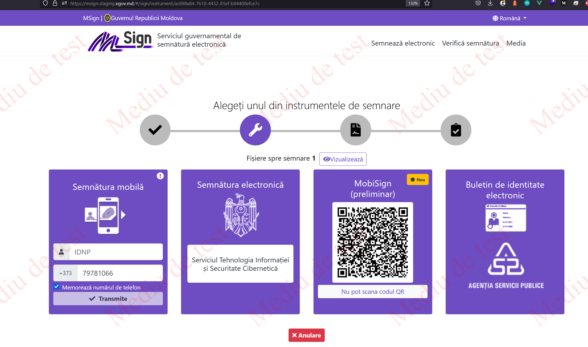

# MSign-Example

<p>Assuming you have been through the circles of bureaucratic hell and you got your certificates here is an example how to integrate Msign service in our app.</p>

<p>If you are on start of your journey here is official guide what docs you need(https://mpass.gov.md/info/procedure). After that you can come back soo lets gooooo</p>

<p>MSign uses a SOAP server, you will need to create a SOAP client to access WSDL methods. To have access you will need to create a secure connection with the certs.</p>

```typescript
const client = await createClientAsync(WSDL_URL, {
  wsdl_options: {
    httpsAgent: new https.Agent({
      keepAlive: true,
      cert: this.pkiCert,
      key: this.privateKey,
    }),
  },
});

client.setSecurity(new ClientSSLSecurity(this.privateKey, this.pkiCert, {}));
```

<p>With client.describe() you can explore what methods there are. What inputs and outputs for each method.</p>

# Sign documents

<p>First at all the sign method only works with PDF and XML format. The request object thats bellow, its a example of the input request for the PostSignRequestAsync method. Also you can add multiple files to sign. </p>

```typescript
const request = {
  ContentType: 'Pdf',
  Contents: {
    SignContent: [
      {
        Content: Buffer,
      },
      {
        Content: Buffer,
      },
    ],
  },
  ShortContentDescription: 'Cerere',
};

const [result] = await client.PostSignRequestAsync({ request });
```

<p>As the output you will get an id that you can use as parameter to msign webpage https://msign.staging.egov.md/${id} </p>

```json
{
  "success": true,
  "payload": "ac898a847610443281efb04400efce7c",
  "message": "OK"
}
```

<p>The url have some additional query parameters that can be add optionally</p>

<p>
<summary>ReturnUrl - The URL that will receive the result of transaction
signing</summary>
<summary>RelayState - Optional string that will be returned back unmodified
after signing</summary>
<summary>lang - Language to be used by MSign user interface.</summary>
</p>



# Sign status

<p>To get the state of the signing process you need to provide as input the id.</p>

```typescript
const request = {
  requestID: id,
};
const [result] = await client.GetSignResponseAsync(request);
```

<p>The output of this function have 4 states: Pending | Success | Failure | Expired.</p>

```json
{
  "success": true,
  "payload": "Pending",
  "message": "OK"
}
```

# Verify Sign

<p>With this method you can input a PDF or XML as content to verify if the sign is valid. </p>

```typescript
const request = {
  Contents: {
    VerificationContent: [{ Content: Buffer }, { Signature: Buffer }],
  },
  SignedContentType: 'Pdf',
};

const [result] = await client.VerifySignaturesAsync({ request });
```

<p>As the output you get information about when, by who and if the sign is valid.</p>

```json
{
  "success": true,
  "payload": [
    {
      "Certificates": {
        "VerificationCertificate": [
          {
            "Certificate": "Public certificate",
            "SignatureValid": true,
            "SignedAt": "2023-07-13T11:05:51.000Z",
            "Subject": "Info about who sign the document"
          }
        ]
      },
      "Message": "Semnătura este validă",
      "SignaturesValid": true
    },
    {
      "Message": "Semnătura nu este validă",
      "SignaturesValid": false
    }
  ],
  "message": "OK"
}
```

# To do

<summary>How to download files that where sign</summary>
<summary>Generate a pdf file </summary>
<summary>Upload file to sign </summary>

# Shout-out

<p>A great library with a good documentation saved my life - <a href="https://github.com/vpulim/node-soap" target="_blank">node-soap</a></p>

<p>Big W for the instruments and services that eGov have achieved this years - <a href="https://egov.md/ro">eGov official page</a> </p>
